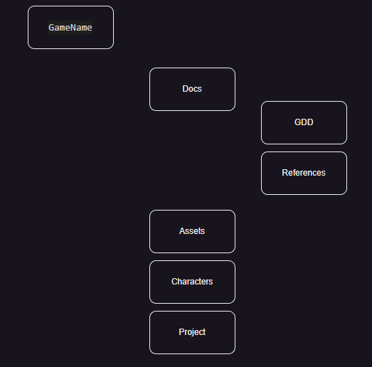
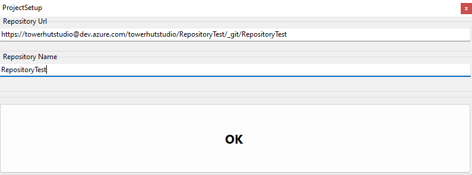
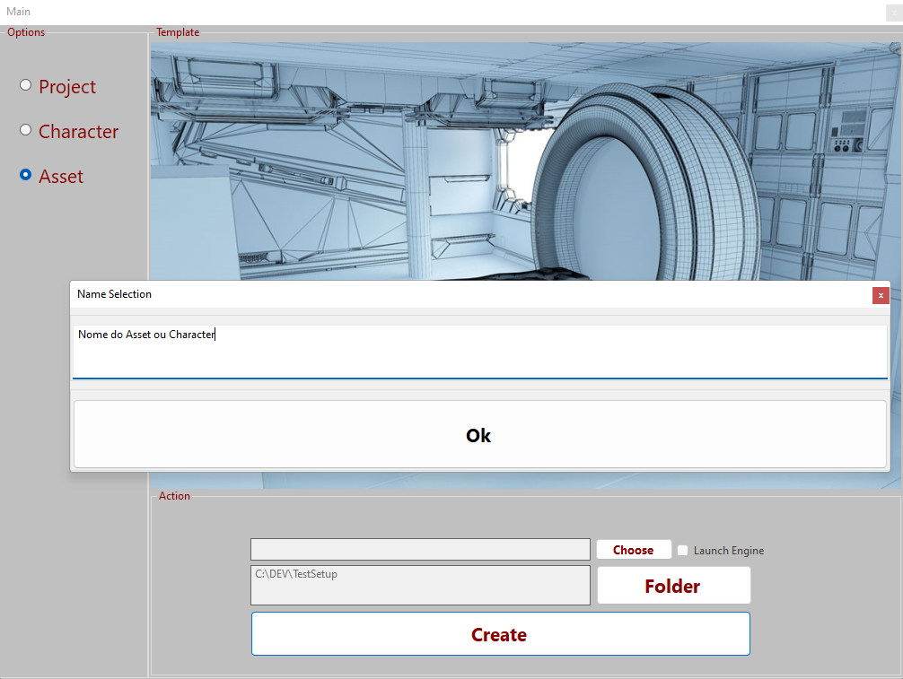

# GameDeveloperSetup

## Descrição 
Este projeto tem como objetivo desenvolver uma aplicação desktop que forneça ao desenvolvedor templates para organização de projetos de **Modelagem 3D/Desenvolvimento de Jogos**. São estes:
- Project
- Character
- Asset

### **Project**
Destinado para desenvolvimento de games utilizando Unreal Engine seguindo a estrutura de diretórios na imagem abaixo

#### Como executar:
- 1 - Escolha o caminho desejado para iniciar o desenvolvimento Clicando no botão **Folder**
- 2 - Clique em no Botão **Create**, será aberto um prompt onde deve ser informado _url_ e _nome_ do repositório _Git_
- 3 - Clique em **OK**

**Opcional**: Clique no botão choose para definir o caminho on está instalado a Unreal Engine Ex: _C:\Program Files\Epic Games\UE_5.1\Engine\Binaries\Win64_ , em seguida, marque a checkbox _Launch Engine_ e execute o passo a passo acima. Esse procedimento é para executar a Engine após o Create.

### **Character e Asset**
- O template Character é destinado para criação de personagens utilizando os programas _Character Creator 4_, _Blender_ e _Substance Painter_.
- O template Asset é destinado para modelagem de assets no _Blender_ e _Substance Painter_.

#### Como executar:
- 1 - Escolha o caminho desejado para iniciar o desenvolvimento Clicando no botão **Folder**
- 2 - Clique em no Botão **Create**, será aberto um prompt onde deve informado o nome do projeto. 
